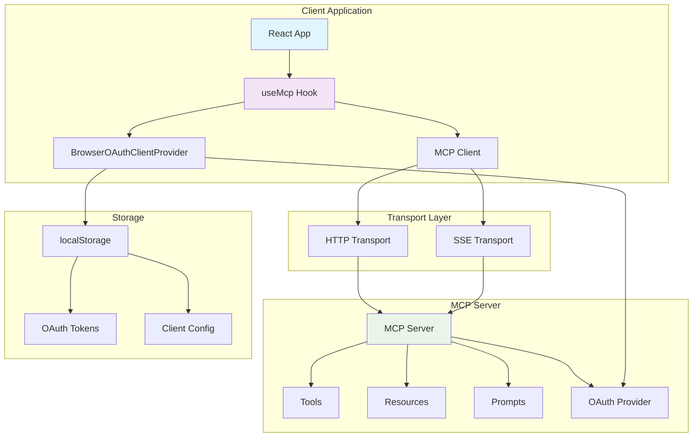
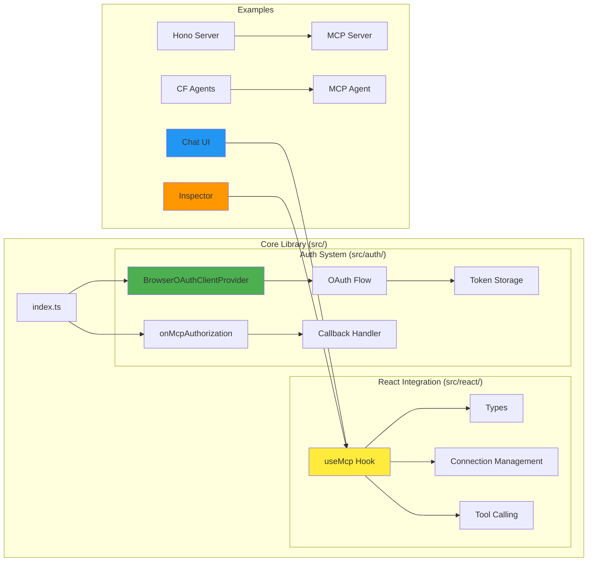
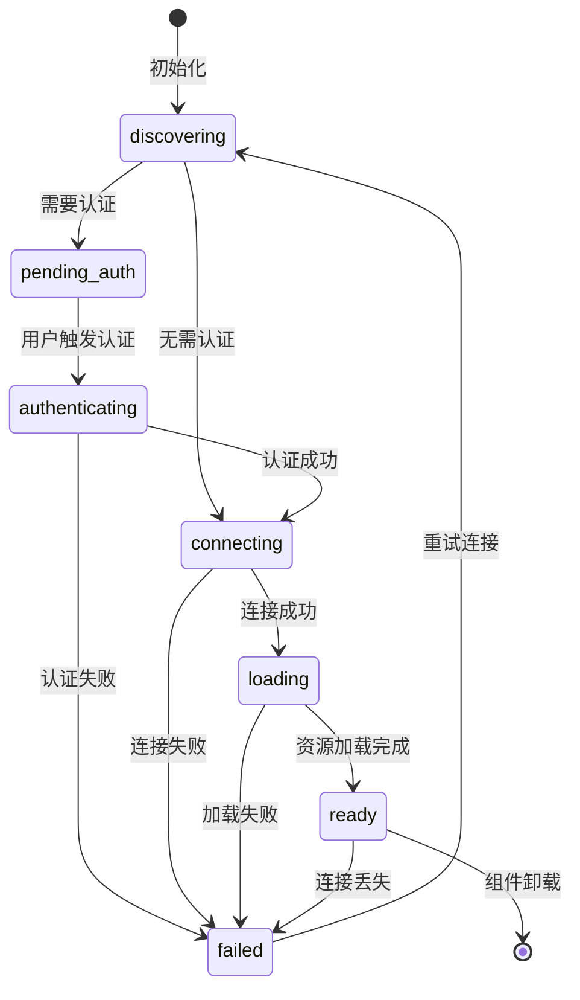
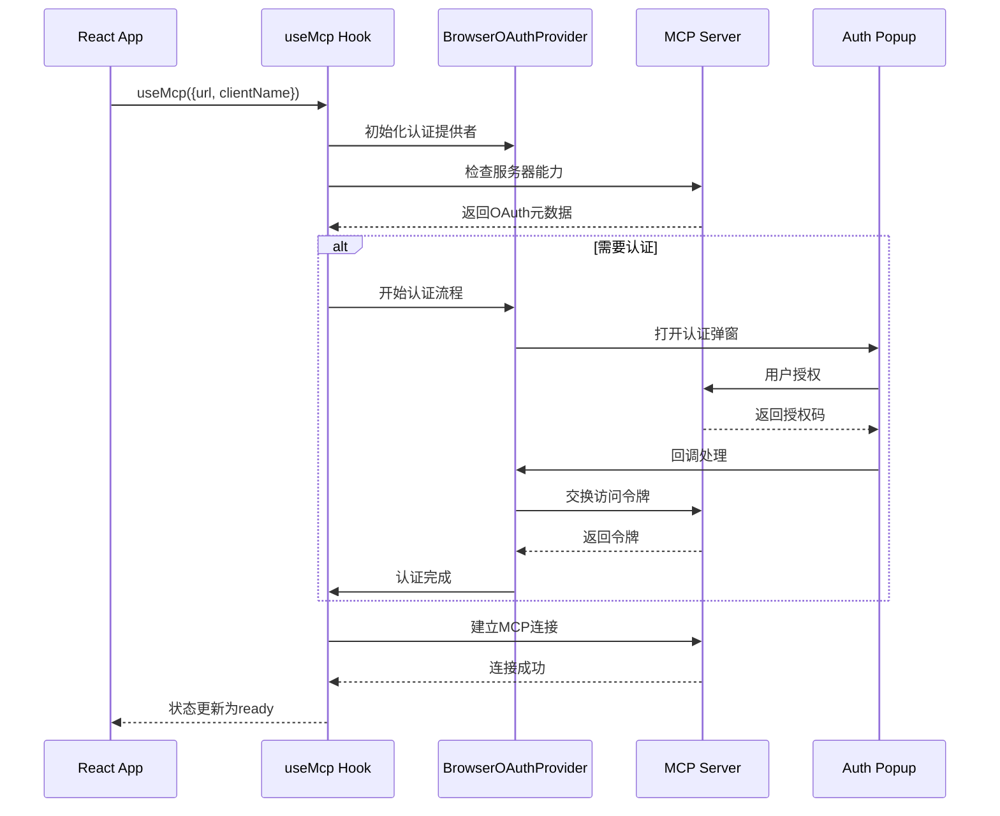
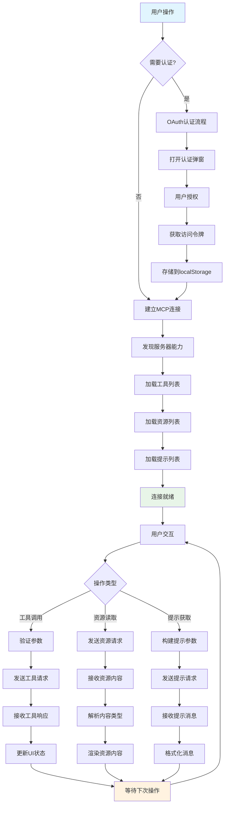
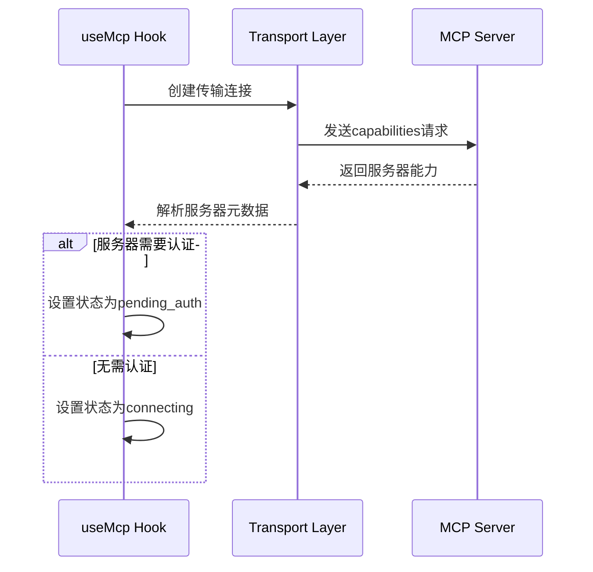
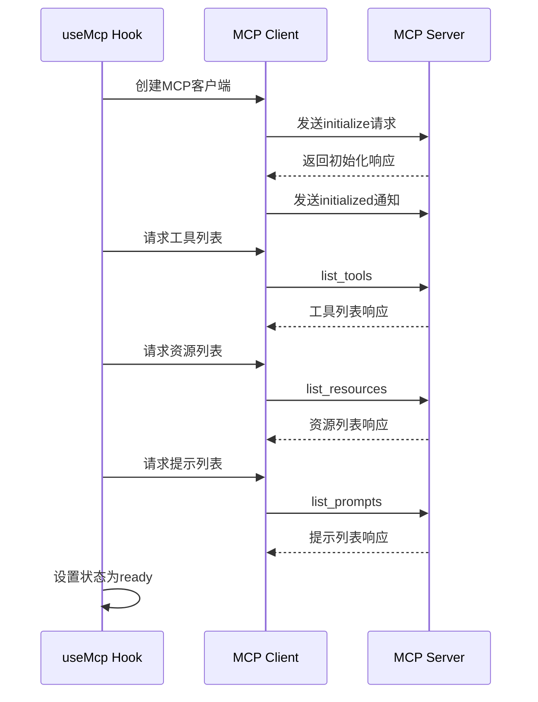
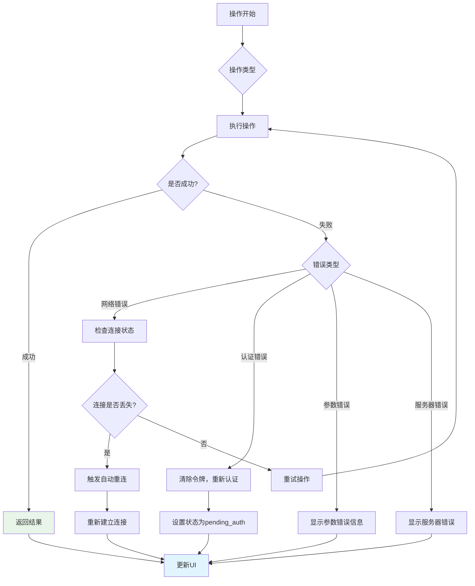

# use-mcp 技术文档

## 目录

- [项目概述](#项目概述)
- [技术栈说明](#技术栈说明)
- [项目架构设计](#项目架构设计)
- [目录结构详细说明](#目录结构详细说明)
- [安装和运行指南](#安装和运行指南)
- [API接口文档](#api接口文档)
- [核心功能模块详解](#核心功能模块详解)
- [数据流程说明](#数据流程说明)
- [配置文件说明](#配置文件说明)
- [开发指南和最佳实践](#开发指南和最佳实践)
- [常见问题和故障排除](#常见问题和故障排除)

## 项目概述

**use-mcp** 是一个轻量级的React Hook库，专门用于连接和集成[Model Context Protocol (MCP)](https://github.com/modelcontextprotocol)服务器。它为AI系统提供了简化的认证和工具调用功能，实现了MCP标准的完整支持。

### 主要功能特性

- 🔄 **自动连接管理** - 支持重连和重试机制
- 🔐 **OAuth认证流程** - 完整的弹窗和回退认证支持
- 📦 **简单的React Hook接口** - 易于集成到React应用中
- 🧰 **完整MCP支持** - 支持工具、资源和提示模板
- 📄 **资源访问** - 读取服务器资源内容
- 💬 **提示模板** - 使用服务器提供的提示模板
- 🧰 **TypeScript支持** - 完整的类型定义和编辑器支持
- 📝 **调试日志** - 详细的调试信息
- 🌐 **多传输协议** - 支持HTTP和SSE（Server-Sent Events）传输

### 应用场景

- AI聊天应用集成MCP工具
- 开发者工具和调试器
- 自动化工作流系统
- 企业级AI助手

## 技术栈说明

### 前端技术栈

| 技术 | 版本 | 用途 | 学习资源 |
|------|------|------|----------|
| **TypeScript** | ^5.8.2 | 类型安全的JavaScript超集 | [TypeScript官方文档](https://www.typescriptlang.org/docs/) |
| **React** | ^19.0.0 | 用户界面构建库 | [React官方文档](https://react.dev/) |
| **Vite** | 最新 | 快速构建工具 | [Vite官方文档](https://vitejs.dev/) |
| **TailwindCSS** | 最新 | 实用优先的CSS框架 | [Tailwind文档](https://tailwindcss.com/docs) |

### 核心依赖

| 依赖 | 版本 | 用途 |
|------|------|------|
| **@modelcontextprotocol/sdk** | ^1.13.3 | MCP协议SDK |
| **strict-url-sanitise** | ^0.0.1 | URL安全处理 |

### 构建和开发工具

| 工具 | 版本 | 用途 |
|------|------|------|
| **tsup** | ^8.4.0 | TypeScript构建工具 |
| **prettier** | ^3.5.3 | 代码格式化 |
| **husky** | ^9.1.7 | Git钩子管理 |
| **concurrently** | ^9.2.0 | 并行运行多个命令 |

### 部署技术

| 技术 | 用途 |
|------|------|
| **Cloudflare Workers** | 无服务器部署平台 |
| **Wrangler** | Cloudflare Workers CLI工具 |
| **Oranda** | 静态站点生成 |

## 项目架构设计

### 系统架构图



### 核心组件关系



## 目录结构详细说明

```
use-mcp/
├── src/                          # 核心源代码
│   ├── index.ts                  # 主入口文件，导出核心功能
│   ├── auth/                     # 认证相关模块
│   │   ├── browser-provider.ts   # 浏览器OAuth提供者实现
│   │   ├── callback.ts           # OAuth回调处理
│   │   └── types.ts              # 认证相关类型定义
│   ├── react/                    # React集成
│   │   ├── index.ts              # React模块入口
│   │   ├── useMcp.ts             # 核心React Hook实现
│   │   └── types.ts              # Hook相关类型定义
│   └── utils/                    # 工具函数
│       └── assert.ts             # 断言工具
├── examples/                     # 示例应用
│   ├── chat-ui/                  # AI聊天界面示例
│   │   ├── src/                  # 聊天应用源码
│   │   ├── api/                  # Cloudflare Workers API
│   │   └── package.json          # 聊天应用依赖
│   ├── inspector/                # MCP服务器调试工具
│   │   ├── src/                  # 调试工具源码
│   │   └── package.json          # 调试工具依赖
│   └── servers/                  # 示例MCP服务器
│       ├── hono-mcp/             # 基于Hono的MCP服务器
│       └── cf-agents/            # Cloudflare Agents MCP服务器
├── test/                         # 集成测试
│   ├── integration/              # 集成测试用例
│   └── setup/                    # 测试环境配置
├── scripts/                      # 构建和部署脚本
├── dist/                         # 构建输出目录
├── package.json                  # 项目依赖和脚本
├── tsconfig.json                 # TypeScript配置
├── tsup.config.js                # 构建配置
└── wrangler.jsonc                # Cloudflare Workers配置
```

### 关键文件说明

#### 核心文件
- **`src/index.ts`** - 库的主入口，导出浏览器相关功能
- **`src/react/useMcp.ts`** - 核心React Hook实现，包含连接管理、认证、工具调用等功能
- **`src/auth/browser-provider.ts`** - 浏览器环境下的OAuth认证提供者

#### 配置文件
- **`package.json`** - 项目元数据、依赖管理、构建脚本
- **`tsconfig.json`** - TypeScript编译配置
- **`tsup.config.js`** - 构建工具配置，支持ESM格式输出

#### 示例应用
- **`examples/chat-ui/`** - 完整的AI聊天应用，展示如何集成MCP工具
- **`examples/inspector/`** - MCP服务器调试工具，用于测试和调试MCP连接
- **`examples/servers/`** - 示例MCP服务器实现

## 安装和运行指南

### 环境要求

- **Node.js**: >= 18.0.0
- **包管理器**: pnpm (推荐) / npm / yarn
- **浏览器**: 支持ES2022的现代浏览器

### 依赖安装

#### 1. 安装use-mcp库

```bash
# 使用pnpm (推荐)
pnpm add use-mcp

# 使用npm
npm install use-mcp

# 使用yarn
yarn add use-mcp
```

#### 2. 安装必要的对等依赖

```bash
# React应用还需要安装React
pnpm add react react-dom

# TypeScript项目需要类型定义
pnpm add -D @types/react @types/react-dom
```

### 开发环境启动

#### 1. 克隆项目并安装依赖

```bash
# 克隆仓库
git clone https://github.com/modelcontextprotocol/use-mcp.git
cd use-mcp

# 安装所有依赖（包括示例应用）
pnpm install:all
```

#### 2. 启动开发环境

```bash
# 启动完整开发环境（库 + 所有示例）
pnpm dev
```

这将启动以下服务：

| 服务 | 端口 | 描述 |
|------|------|------|
| **MCP Inspector** | http://localhost:5001 | MCP服务器调试工具 |
| **Chat UI** | http://localhost:5002 | AI聊天界面示例 |
| **Hono MCP Server** | http://localhost:5101 | 基于Hono的示例MCP服务器 |
| **CF Agents Server** | http://localhost:5102 | Cloudflare Workers AI MCP服务器 |

#### 3. 单独运行示例

```bash
# 只运行聊天界面
cd examples/chat-ui && pnpm dev

# 只运行调试工具
cd examples/inspector && pnpm dev

# 只运行Hono服务器
cd examples/servers/hono-mcp && pnpm dev
```

### 构建和部署

#### 1. 构建库

```bash
# 构建核心库
pnpm build

# 监听模式构建（开发时使用）
pnpm build:watch
```

#### 2. 部署示例应用

```bash
# 部署所有示例到Cloudflare
pnpm deploy:all

# 单独部署聊天应用
cd examples/chat-ui && pnpm deploy

# 单独部署调试工具
cd examples/inspector && pnpm deploy
```

### 测试

#### 1. 运行集成测试

```bash
cd test

# 无头模式运行测试
pnpm test

# 有界面模式运行测试
pnpm test:headed

# 监听模式运行测试
pnpm test:watch

# 交互式UI运行测试
pnpm test:ui
```

#### 2. 代码质量检查

```bash
# 类型检查和代码格式检查
pnpm check

# 自动修复代码格式
pnpm prettier:fix
```

## API接口文档

### useMcp Hook

`useMcp` 是核心React Hook，提供与MCP服务器的完整集成功能。

#### 基本用法

```tsx
import { useMcp } from 'use-mcp/react'

function MyComponent() {
  const connection = useMcp({
    url: 'https://your-mcp-server.com',
    clientName: 'My App',
    autoReconnect: true,
  })

  // 使用connection对象访问MCP功能
  return <div>Connection state: {connection.state}</div>
}
```

#### 配置选项 (UseMcpOptions)

| 参数 | 类型 | 必需 | 默认值 | 描述 |
|------|------|------|--------|------|
| `url` | `string` | ✅ | - | MCP服务器的URL地址 |
| `clientName` | `string` | ❌ | - | OAuth注册时的客户端名称 |
| `clientUri` | `string` | ❌ | - | OAuth注册时的客户端URI |
| `callbackUrl` | `string` | ❌ | `/oauth/callback` | OAuth重定向回调URL |
| `storageKeyPrefix` | `string` | ❌ | `"mcp:auth"` | localStorage中的存储键前缀 |
| `clientConfig` | `object` | ❌ | - | MCP客户端身份配置 |
| `debug` | `boolean` | ❌ | `false` | 是否启用详细调试日志 |
| `autoRetry` | `boolean \| number` | ❌ | `false` | 自动重试连接，可指定延迟毫秒数 |
| `autoReconnect` | `boolean \| number` | ❌ | `3000` | 自动重连，可指定延迟毫秒数 |
| `transportType` | `'auto' \| 'http' \| 'sse'` | ❌ | `'auto'` | 传输协议类型偏好 |
| `preventAutoAuth` | `boolean` | ❌ | `false` | 阻止自动弹出认证窗口 |

#### 返回值 (UseMcpResult)

| 属性 | 类型 | 描述 |
|------|------|------|
| `state` | `ConnectionState` | 当前连接状态 |
| `tools` | `Tool[]` | 可用工具列表 |
| `resources` | `Resource[]` | 可用资源列表 |
| `resourceTemplates` | `ResourceTemplate[]` | 资源模板列表 |
| `prompts` | `Prompt[]` | 可用提示模板列表 |
| `error` | `string \| undefined` | 错误信息 |
| `authUrl` | `string \| undefined` | 手动认证URL |
| `log` | `LogEntry[]` | 调试日志数组 |
| `callTool` | `Function` | 调用工具函数 |
| `listResources` | `Function` | 刷新资源列表 |
| `readResource` | `Function` | 读取资源内容 |
| `listPrompts` | `Function` | 刷新提示列表 |
| `getPrompt` | `Function` | 获取提示内容 |
| `retry` | `Function` | 手动重试连接 |
| `disconnect` | `Function` | 断开连接 |
| `authenticate` | `Function` | 手动触发认证 |
| `clearStorage` | `Function` | 清除存储的认证数据 |

#### 连接状态说明

```typescript
type ConnectionState =
  | 'discovering'    // 检查服务器存在性和能力
  | 'pending_auth'   // 需要认证但阻止了自动弹窗
  | 'authenticating' // 正在进行认证流程
  | 'connecting'     // 正在建立连接
  | 'loading'        // 正在加载服务器资源
  | 'ready'          // 连接就绪，可以使用
  | 'failed'         // 连接失败
```

#### 核心方法详解

##### callTool - 调用工具

```typescript
const callTool = async (
  name: string,
  args?: Record<string, unknown>
) => Promise<any>
```

**示例：**
```tsx
const handleSearch = async () => {
  try {
    const result = await callTool('search', {
      query: 'example search',
      limit: 10
    })
    console.log('搜索结果:', result)
  } catch (error) {
    console.error('工具调用失败:', error)
  }
}
```

##### readResource - 读取资源

```typescript
const readResource = async (uri: string) => Promise<{
  contents: Array<{
    uri: string
    mimeType?: string
    text?: string
    blob?: Uint8Array
  }>
}>
```

**示例：**
```tsx
const handleReadResource = async () => {
  try {
    const content = await readResource('config://app-settings')
    console.log('资源内容:', content.contents[0].text)
  } catch (error) {
    console.error('读取资源失败:', error)
  }
}
```

##### getPrompt - 获取提示

```typescript
const getPrompt = async (
  name: string,
  args?: Record<string, string>
) => Promise<{
  messages: Array<{
    role: 'user' | 'assistant' | 'system'
    content: {
      type: 'text' | 'image'
      text?: string
      data?: string
      mimeType?: string
    }
  }>
}>
```

**示例：**
```tsx
const handleGetPrompt = async () => {
  try {
    const prompt = await getPrompt('math_problem', {
      difficulty: 'medium',
      topic: 'algebra'
    })
    console.log('提示消息:', prompt.messages)
  } catch (error) {
    console.error('获取提示失败:', error)
  }
}
```

### OAuth回调处理

#### onMcpAuthorization

用于处理OAuth认证回调的函数，通常在回调页面中调用。

```typescript
import { onMcpAuthorization } from 'use-mcp'

// 在OAuth回调页面中使用
useEffect(() => {
  onMcpAuthorization()
}, [])
```

#### 设置OAuth回调路由

##### React Router示例

```tsx
import { BrowserRouter, Routes, Route } from 'react-router-dom'
import { useEffect } from 'react'
import { onMcpAuthorization } from 'use-mcp'

function OAuthCallback() {
  useEffect(() => {
    onMcpAuthorization()
  }, [])

  return (
    <div>
      <h1>正在认证...</h1>
      <p>此窗口将自动关闭。</p>
    </div>
  )
}

function App() {
  return (
    <BrowserRouter>
      <Routes>
        <Route path="/oauth/callback" element={<OAuthCallback />} />
        <Route path="/" element={<MainApp />} />
      </Routes>
    </BrowserRouter>
  )
}
```

##### Next.js Pages Router示例

```tsx
// pages/oauth/callback.tsx
import { useEffect } from 'react'
import { onMcpAuthorization } from 'use-mcp'

export default function OAuthCallbackPage() {
  useEffect(() => {
    onMcpAuthorization()
  }, [])

  return (
    <div>
      <h1>正在认证...</h1>
      <p>此窗口将自动关闭。</p>
    </div>
  )
}
```

### 类型定义

#### Tool类型

```typescript
interface Tool {
  name: string
  description?: string
  inputSchema: {
    type: 'object'
    properties: Record<string, any>
    required?: string[]
  }
}
```

#### Resource类型

```typescript
interface Resource {
  uri: string
  name: string
  description?: string
  mimeType?: string
}
```

#### Prompt类型

```typescript
interface Prompt {
  name: string
  description?: string
  arguments?: Array<{
    name: string
    description?: string
    required?: boolean
  }>
}
```

## 核心功能模块详解

### 1. 连接管理模块

连接管理是use-mcp的核心功能，负责建立和维护与MCP服务器的连接。

#### 连接生命周期



#### 自动重连机制

```typescript
// 配置自动重连
const connection = useMcp({
  url: 'https://mcp-server.com',
  autoReconnect: true,        // 启用自动重连
  autoRetry: 5000,           // 初始连接失败后5秒重试
})
```

**重连策略：**
- **autoRetry**: 初始连接失败时的重试机制
- **autoReconnect**: 已建立连接丢失后的重连机制
- **指数退避**: 多次失败后逐渐增加重试间隔

#### 传输协议支持

use-mcp支持多种传输协议：

| 协议 | 特点 | 适用场景 |
|------|------|----------|
| **HTTP** | 请求-响应模式，简单可靠 | 简单工具调用，低频交互 |
| **SSE** | 服务器推送，实时性好 | 实时通知，流式响应 |
| **Auto** | 自动选择最佳协议 | 大多数场景（推荐） |

```typescript
// 指定传输协议
const connection = useMcp({
  url: 'https://mcp-server.com',
  transportType: 'sse',  // 强制使用SSE
})
```

### 2. OAuth认证模块

OAuth认证模块处理与MCP服务器的安全认证流程。

#### 认证流程图



#### 认证配置

```typescript
const connection = useMcp({
  url: 'https://mcp-server.com',
  clientName: 'My AI App',                    // 应用名称
  clientUri: 'https://my-app.com',            // 应用主页
  callbackUrl: 'https://my-app.com/callback', // 自定义回调URL
  storageKeyPrefix: 'myapp:mcp',              // 存储前缀
  preventAutoAuth: false,                     // 是否阻止自动认证
})
```

#### 手动认证处理

```typescript
function AuthComponent() {
  const { state, authUrl, authenticate, error } = useMcp({
    url: 'https://mcp-server.com',
    preventAutoAuth: true,  // 阻止自动弹窗
  })

  if (state === 'pending_auth') {
    return (
      <div>
        <p>需要认证才能连接到MCP服务器</p>
        <button onClick={authenticate}>
          开始认证
        </button>
        {authUrl && (
          <a href={authUrl} target="_blank" rel="noopener noreferrer">
            手动认证（如果弹窗被阻止）
          </a>
        )}
      </div>
    )
  }

  if (state === 'failed') {
    return (
      <div>
        <p>认证失败: {error}</p>
        <button onClick={authenticate}>重试认证</button>
      </div>
    )
  }

  return <div>认证状态: {state}</div>
}
```

### 3. 工具调用模块

工具调用模块提供与MCP服务器工具的交互功能。

#### 工具发现和调用

```typescript
function ToolsComponent() {
  const { tools, callTool, state } = useMcp({
    url: 'https://mcp-server.com'
  })

  const handleToolCall = async (toolName: string) => {
    try {
      // 根据工具schema构建参数
      const args = buildToolArgs(toolName)
      const result = await callTool(toolName, args)

      console.log(`工具 ${toolName} 执行结果:`, result)
    } catch (error) {
      console.error(`工具 ${toolName} 执行失败:`, error)
    }
  }

  if (state !== 'ready') {
    return <div>正在连接...</div>
  }

  return (
    <div>
      <h3>可用工具 ({tools.length})</h3>
      {tools.map(tool => (
        <div key={tool.name}>
          <h4>{tool.name}</h4>
          <p>{tool.description}</p>
          <button onClick={() => handleToolCall(tool.name)}>
            执行工具
          </button>
          <details>
            <summary>参数Schema</summary>
            <pre>{JSON.stringify(tool.inputSchema, null, 2)}</pre>
          </details>
        </div>
      ))}
    </div>
  )
}
```

#### 工具参数验证

```typescript
import { z } from 'zod'

// 根据工具schema创建验证器
function createToolValidator(tool: Tool) {
  const schema = tool.inputSchema

  // 转换JSON Schema到Zod schema
  const zodSchema = jsonSchemaToZod(schema)

  return (args: unknown) => {
    try {
      return zodSchema.parse(args)
    } catch (error) {
      throw new Error(`工具参数验证失败: ${error.message}`)
    }
  }
}

// 安全的工具调用
async function safeCallTool(
  callTool: Function,
  tool: Tool,
  args: unknown
) {
  const validator = createToolValidator(tool)
  const validatedArgs = validator(args)

  return await callTool(tool.name, validatedArgs)
}
```

### 4. 资源管理模块

资源管理模块处理MCP服务器提供的资源访问。

#### 资源类型支持

| 资源类型 | MIME类型 | 处理方式 |
|----------|----------|----------|
| **文本资源** | `text/*` | 直接显示文本内容 |
| **JSON数据** | `application/json` | 解析为JavaScript对象 |
| **图像资源** | `image/*` | Base64编码显示 |
| **二进制文件** | `application/octet-stream` | Uint8Array处理 |

#### 资源浏览器组件

```typescript
function ResourceBrowser() {
  const { resources, readResource, state } = useMcp({
    url: 'https://mcp-server.com'
  })

  const [selectedResource, setSelectedResource] = useState<string | null>(null)
  const [resourceContent, setResourceContent] = useState<any>(null)
  const [loading, setLoading] = useState(false)

  const handleResourceSelect = async (uri: string) => {
    setLoading(true)
    setSelectedResource(uri)

    try {
      const content = await readResource(uri)
      setResourceContent(content)
    } catch (error) {
      console.error('读取资源失败:', error)
      setResourceContent(null)
    } finally {
      setLoading(false)
    }
  }

  if (state !== 'ready') {
    return <div>正在连接...</div>
  }

  return (
    <div className="resource-browser">
      <div className="resource-list">
        <h3>可用资源 ({resources.length})</h3>
        {resources.map(resource => (
          <div
            key={resource.uri}
            className={`resource-item ${selectedResource === resource.uri ? 'selected' : ''}`}
            onClick={() => handleResourceSelect(resource.uri)}
          >
            <h4>{resource.name}</h4>
            <p>{resource.description}</p>
            <small>{resource.mimeType}</small>
          </div>
        ))}
      </div>

      <div className="resource-content">
        {loading && <div>正在加载...</div>}
        {resourceContent && (
          <ResourceViewer content={resourceContent} />
        )}
      </div>
    </div>
  )
}
```

### 5. 提示模板模块

提示模板模块管理服务器提供的AI提示模板。

#### 提示模板使用

```typescript
function PromptManager() {
  const { prompts, getPrompt } = useMcp({
    url: 'https://mcp-server.com'
  })

  const handlePromptUse = async (promptName: string, args: Record<string, string>) => {
    try {
      const prompt = await getPrompt(promptName, args)

      // 将提示消息发送给AI模型
      const aiResponse = await sendToAI(prompt.messages)

      console.log('AI响应:', aiResponse)
    } catch (error) {
      console.error('获取提示失败:', error)
    }
  }

  return (
    <div>
      <h3>可用提示模板</h3>
      {prompts.map(prompt => (
        <PromptCard
          key={prompt.name}
          prompt={prompt}
          onUse={handlePromptUse}
        />
      ))}
    </div>
  )
}

function PromptCard({ prompt, onUse }: {
  prompt: Prompt,
  onUse: (name: string, args: Record<string, string>) => void
}) {
  const [args, setArgs] = useState<Record<string, string>>({})

  const handleSubmit = () => {
    onUse(prompt.name, args)
  }

  return (
    <div className="prompt-card">
      <h4>{prompt.name}</h4>
      <p>{prompt.description}</p>

      {prompt.arguments?.map(arg => (
        <div key={arg.name}>
          <label>
            {arg.name} {arg.required && '*'}
            <input
              type="text"
              value={args[arg.name] || ''}
              onChange={(e) => setArgs({
                ...args,
                [arg.name]: e.target.value
              })}
              placeholder={arg.description}
            />
          </label>
        </div>
      ))}

      <button onClick={handleSubmit}>使用提示</button>
    </div>
  )
}
```

## 数据流程说明

### 完整数据流程图



### 用户操作到结果展示的详细流程

#### 1. 初始化阶段

```typescript
// 1. 组件挂载，Hook初始化
const connection = useMcp({ url: 'https://mcp-server.com' })

// 2. 内部流程
// - 创建BrowserOAuthClientProvider实例
// - 检查localStorage中的现有令牌
// - 开始服务器发现流程
```

#### 2. 服务器发现阶段



#### 3. 认证阶段（如需要）

```typescript
// 认证触发
authenticate() // 用户点击认证按钮

// 内部流程：
// 1. 生成PKCE代码验证器
// 2. 构建授权URL
// 3. 打开弹窗或重定向
// 4. 用户完成授权
// 5. 回调处理交换令牌
// 6. 存储令牌到localStorage
```

#### 4. 连接建立阶段



#### 5. 工具调用流程

```typescript
// 用户调用工具
const result = await callTool('search', { query: 'example' })

// 内部流程：
// 1. 参数验证
// 2. 构建JSON-RPC请求
// 3. 发送到MCP服务器
// 4. 等待响应
// 5. 解析结果
// 6. 返回给用户
```

#### 6. 错误处理流程



### 状态管理流程

#### React状态更新机制

```typescript
// useMcp内部状态管理
const [state, setState] = useState<ConnectionState>('discovering')
const [tools, setTools] = useState<Tool[]>([])
const [resources, setResources] = useState<Resource[]>([])
const [error, setError] = useState<string | undefined>()

// 状态更新触发重渲染
useEffect(() => {
  // 当连接状态改变时，通知所有使用该Hook的组件
  console.log('连接状态更新:', state)
}, [state])
```

#### 数据缓存策略

```typescript
// 工具列表缓存
const toolsRef = useRef<Tool[]>([])

// 只在连接建立时加载一次
const loadTools = useCallback(async () => {
  if (toolsRef.current.length === 0) {
    const result = await client.listTools()
    toolsRef.current = result.tools
    setTools(result.tools)
  }
}, [client])
```

## 配置文件说明

### package.json 配置详解

```json
{
  "name": "use-mcp",
  "version": "0.0.19",
  "type": "module",                    // 使用ES模块
  "files": [                          // 发布到npm的文件
    "dist",
    "README.md",
    "LICENSE"
  ],
  "exports": {                        // 模块导出配置
    ".": {                            // 主入口
      "types": "./dist/index.d.ts",
      "require": "./dist/index.js",
      "import": "./dist/index.js"
    },
    "./react": {                      // React子模块
      "types": "./dist/react/index.d.ts",
      "require": "./dist/react/index.js",
      "import": "./dist/react/index.js"
    }
  },
  "scripts": {
    "install:all": "concurrently 'pnpm install' 'cd examples/chat-ui && pnpm install' 'cd examples/inspector && pnpm install' 'cd examples/servers/hono-mcp && pnpm install' 'cd examples/servers/cf-agents && pnpm install'",
    "dev": "concurrently 'pnpm:build:watch' 'cd examples/chat-ui && pnpm dev' 'cd examples/inspector && pnpm dev' 'sleep 1 && cd examples/servers/hono-mcp && pnpm dev' 'sleep 2 && cd examples/servers/cf-agents && pnpm dev'",
    "build": "tsup",                  // 构建命令
    "build:watch": "tsup --watch",    // 监听模式构建
    "check": "prettier --check . && tsc", // 代码检查
    "deploy:all": "concurrently 'pnpm build:site && pnpm deploy:site' 'cd examples/chat-ui && pnpm run deploy' 'cd examples/inspector && pnpm run deploy'"
  },
  "dependencies": {
    "@modelcontextprotocol/sdk": "^1.13.3", // MCP协议SDK
    "strict-url-sanitise": "^0.0.1"         // URL安全处理
  },
  "devDependencies": {
    "@types/react": "^19.0.12",      // React类型定义
    "react": "^19.0.0",              // React（对等依赖）
    "tsup": "^8.4.0",                // 构建工具
    "typescript": "^5.8.2",          // TypeScript编译器
    "prettier": "^3.5.3",            // 代码格式化
    "husky": "^9.1.7"                // Git钩子
  },
  "tsup": {                           // tsup构建配置
    "entry": [
      "src/index.ts",
      "src/react/index.ts"
    ],
    "format": ["esm"],                // 输出ES模块格式
    "dts": true,                      // 生成类型定义文件
    "clean": true,                    // 构建前清理输出目录
    "outDir": "dist",                 // 输出目录
    "external": [                     // 外部依赖（不打包）
      "react",
      "@modelcontextprotocol/sdk"
    ]
  }
}
```

### TypeScript配置 (tsconfig.json)

```json
{
  "compilerOptions": {
    "target": "ES2022",               // 编译目标
    "module": "ES2022",               // 模块系统
    "moduleResolution": "bundler",    // 模块解析策略
    "strict": true,                   // 严格模式
    "esModuleInterop": true,          // ES模块互操作
    "noEmit": true,                   // 不输出文件（仅类型检查）
    "lib": ["ES2022", "DOM"],         // 包含的库
    "types": ["react"],               // 包含的类型定义
    "forceConsistentCasingInFileNames": true,
    "resolveJsonModule": true         // 支持导入JSON文件
  },
  "exclude": ["examples", "test"]     // 排除的目录
}
```

### 构建配置说明

#### tsup配置详解

```typescript
// tsup.config.ts (如果使用配置文件)
import { defineConfig } from 'tsup'

export default defineConfig({
  entry: [
    'src/index.ts',        // 主入口
    'src/react/index.ts'   // React子模块入口
  ],
  format: ['esm'],         // 输出格式：ES模块
  dts: true,              // 生成.d.ts类型定义文件
  clean: true,            // 构建前清理dist目录
  outDir: 'dist',         // 输出目录
  external: [             // 外部依赖，不会被打包
    'react',
    'react-dom',
    '@modelcontextprotocol/sdk'
  ],
  splitting: false,       // 不启用代码分割
  sourcemap: true,        // 生成源码映射
  minify: false,          // 不压缩代码（库模式）
  treeshake: true,        // 启用树摇优化
})
```

#### 为什么选择这些配置？

1. **ES模块格式**: 现代JavaScript标准，支持树摇优化
2. **外部依赖**: React和MCP SDK作为对等依赖，避免重复打包
3. **类型定义**: 提供完整的TypeScript支持
4. **源码映射**: 便于调试和错误追踪

### Cloudflare Workers配置 (wrangler.jsonc)

```jsonc
{
  "name": "use-mcp-site",
  "compatibility_date": "2024-01-01",
  "compatibility_flags": ["nodejs_compat"],
  "pages_build_output_dir": "dist",
  // 静态资产配置
  "assets": {
    "directory": "dist",
    "binding": "ASSETS"
  }
}
```

## 开发指南和最佳实践

### 1. 项目集成最佳实践

#### 基本集成步骤

1. **安装依赖**
```bash
pnpm add use-mcp react react-dom
pnpm add -D @types/react @types/react-dom
```

2. **设置OAuth回调路由**
```typescript
// 确保应用中有OAuth回调处理
import { onMcpAuthorization } from 'use-mcp'

// 在回调页面中调用
useEffect(() => {
  onMcpAuthorization()
}, [])
```

3. **配置MCP连接**
```typescript
const connection = useMcp({
  url: process.env.REACT_APP_MCP_SERVER_URL,
  clientName: process.env.REACT_APP_CLIENT_NAME,
  debug: process.env.NODE_ENV === 'development',
})
```

#### 环境变量配置

```bash
# .env.local
REACT_APP_MCP_SERVER_URL=https://your-mcp-server.com
REACT_APP_CLIENT_NAME=My AI Application
REACT_APP_CLIENT_URI=https://my-app.com
```

### 2. 错误处理最佳实践

#### 全面的错误处理

```typescript
function McpComponent() {
  const { state, error, tools, callTool, retry, authenticate } = useMcp({
    url: 'https://mcp-server.com',
    debug: true,
  })

  // 渲染不同状态的UI
  const renderConnectionState = () => {
    switch (state) {
      case 'discovering':
        return <LoadingSpinner message="正在发现服务器..." />

      case 'pending_auth':
        return (
          <AuthPrompt
            onAuthenticate={authenticate}
            message="需要认证才能访问MCP服务器"
          />
        )

      case 'authenticating':
        return <LoadingSpinner message="正在认证..." />

      case 'connecting':
        return <LoadingSpinner message="正在连接..." />

      case 'loading':
        return <LoadingSpinner message="正在加载资源..." />

      case 'failed':
        return (
          <ErrorDisplay
            error={error}
            onRetry={retry}
            onReauth={authenticate}
          />
        )

      case 'ready':
        return <McpInterface tools={tools} callTool={callTool} />

      default:
        return <div>未知状态: {state}</div>
    }
  }

  return (
    <div className="mcp-component">
      {renderConnectionState()}
    </div>
  )
}
```

#### 工具调用错误处理

```typescript
const safeCallTool = async (toolName: string, args: any) => {
  try {
    const result = await callTool(toolName, args)
    return { success: true, data: result }
  } catch (error) {
    console.error(`工具调用失败 [${toolName}]:`, error)

    // 根据错误类型进行不同处理
    if (error.message.includes('Unauthorized')) {
      // 认证过期，触发重新认证
      authenticate()
      return { success: false, error: '认证已过期，请重新登录' }
    }

    if (error.message.includes('Tool not found')) {
      return { success: false, error: `工具 ${toolName} 不存在` }
    }

    if (error.message.includes('Invalid arguments')) {
      return { success: false, error: '工具参数无效' }
    }

    return { success: false, error: '工具调用失败，请稍后重试' }
  }
}
```

### 3. 性能优化建议

#### 连接复用

```typescript
// 使用Context避免重复连接
const McpContext = createContext<UseMcpResult | null>(null)

export function McpProvider({ children, serverUrl }: {
  children: React.ReactNode
  serverUrl: string
}) {
  const connection = useMcp({
    url: serverUrl,
    autoReconnect: true,
  })

  return (
    <McpContext.Provider value={connection}>
      {children}
    </McpContext.Provider>
  )
}

export function useMcpContext() {
  const context = useContext(McpContext)
  if (!context) {
    throw new Error('useMcpContext must be used within McpProvider')
  }
  return context
}
```

#### 工具调用缓存

```typescript
function useToolCache() {
  const cache = useRef<Map<string, any>>(new Map())
  const { callTool } = useMcpContext()

  const cachedCallTool = useCallback(async (
    toolName: string,
    args: any,
    cacheKey?: string
  ) => {
    const key = cacheKey || `${toolName}:${JSON.stringify(args)}`

    if (cache.current.has(key)) {
      return cache.current.get(key)
    }

    const result = await callTool(toolName, args)
    cache.current.set(key, result)

    return result
  }, [callTool])

  const clearCache = useCallback(() => {
    cache.current.clear()
  }, [])

  return { cachedCallTool, clearCache }
}
```

#### 资源预加载

```typescript
function useResourcePreloader() {
  const { resources, readResource } = useMcpContext()
  const [preloadedResources, setPreloadedResources] = useState<Map<string, any>>(new Map())

  useEffect(() => {
    // 预加载小型资源
    const preloadSmallResources = async () => {
      const smallResources = resources.filter(r =>
        r.mimeType?.startsWith('text/') ||
        r.mimeType === 'application/json'
      )

      for (const resource of smallResources.slice(0, 5)) {
        try {
          const content = await readResource(resource.uri)
          setPreloadedResources(prev => new Map(prev).set(resource.uri, content))
        } catch (error) {
          console.warn(`预加载资源失败: ${resource.uri}`, error)
        }
      }
    }

    if (resources.length > 0) {
      preloadSmallResources()
    }
  }, [resources, readResource])

  return preloadedResources
}
```

### 4. 安全性最佳实践

#### 输入验证

```typescript
import { z } from 'zod'

// 定义工具参数schema
const SearchArgsSchema = z.object({
  query: z.string().min(1).max(1000),
  limit: z.number().int().min(1).max(100).optional(),
  offset: z.number().int().min(0).optional(),
})

// 安全的工具调用
const safeSearch = async (rawArgs: unknown) => {
  try {
    // 验证参数
    const validatedArgs = SearchArgsSchema.parse(rawArgs)

    // 调用工具
    const result = await callTool('search', validatedArgs)
    return result
  } catch (error) {
    if (error instanceof z.ZodError) {
      throw new Error(`参数验证失败: ${error.errors.map(e => e.message).join(', ')}`)
    }
    throw error
  }
}
```

#### 敏感信息处理

```typescript
// 不要在客户端存储敏感信息
const connection = useMcp({
  url: 'https://mcp-server.com',
  // ❌ 不要这样做
  // apiKey: 'secret-key',

  // ✅ 使用OAuth认证
  clientName: 'My App',
  preventAutoAuth: false,
})

// 清理敏感数据
useEffect(() => {
  return () => {
    // 组件卸载时清理敏感数据
    connection.clearStorage()
  }
}, [])
```

### 5. 测试策略

#### 单元测试

```typescript
import { renderHook, act } from '@testing-library/react'
import { useMcp } from 'use-mcp/react'

describe('useMcp Hook', () => {
  it('should initialize with discovering state', () => {
    const { result } = renderHook(() => useMcp({
      url: 'https://test-server.com'
    }))

    expect(result.current.state).toBe('discovering')
    expect(result.current.tools).toEqual([])
    expect(result.current.error).toBeUndefined()
  })

  it('should handle connection failure', async () => {
    const { result } = renderHook(() => useMcp({
      url: 'https://invalid-server.com'
    }))

    // 等待连接失败
    await act(async () => {
      await new Promise(resolve => setTimeout(resolve, 1000))
    })

    expect(result.current.state).toBe('failed')
    expect(result.current.error).toBeDefined()
  })
})
```

#### 集成测试

```typescript
import { test, expect } from '@playwright/test'

test('MCP connection and tool calling', async ({ page }) => {
  await page.goto('http://localhost:3000')

  // 等待连接建立
  await expect(page.locator('[data-testid="connection-status"]')).toContainText('ready')

  // 测试工具调用
  await page.click('[data-testid="call-tool-button"]')
  await page.fill('[data-testid="tool-args"]', '{"query": "test"}')
  await page.click('[data-testid="execute-tool"]')

  // 验证结果
  await expect(page.locator('[data-testid="tool-result"]')).toBeVisible()
})
```

### 6. 调试技巧

#### 启用详细日志

```typescript
const connection = useMcp({
  url: 'https://mcp-server.com',
  debug: true,  // 启用调试日志
})

// 监听日志
useEffect(() => {
  connection.log.forEach(entry => {
    console.log(`[${entry.level}] ${entry.message}`, entry.timestamp)
  })
}, [connection.log])
```

#### 网络请求监控

```typescript
// 在开发者工具中监控网络请求
if (process.env.NODE_ENV === 'development') {
  // 拦截fetch请求
  const originalFetch = window.fetch
  window.fetch = async (...args) => {
    console.log('MCP Request:', args)
    const response = await originalFetch(...args)
    console.log('MCP Response:', response)
    return response
  }
}
```

#### 状态调试组件

```typescript
function McpDebugPanel() {
  const connection = useMcp({ url: 'https://mcp-server.com' })

  if (process.env.NODE_ENV !== 'development') {
    return null
  }

  return (
    <div className="debug-panel">
      <h3>MCP调试信息</h3>
      <div>状态: {connection.state}</div>
      <div>工具数量: {connection.tools.length}</div>
      <div>资源数量: {connection.resources.length}</div>
      <div>错误: {connection.error || '无'}</div>

      <details>
        <summary>详细日志</summary>
        <pre>{JSON.stringify(connection.log, null, 2)}</pre>
      </details>

      <button onClick={connection.retry}>重试连接</button>
      <button onClick={connection.clearStorage}>清除存储</button>
    </div>
  )
}
```

## 常见问题和故障排除

### 1. 连接问题

#### Q: 连接一直停留在"discovering"状态

**可能原因：**
- MCP服务器URL不正确或服务器不可访问
- 网络连接问题
- CORS配置问题

**解决方案：**
```typescript
// 1. 检查服务器URL是否正确
const connection = useMcp({
  url: 'https://your-mcp-server.com', // 确保URL正确
  debug: true, // 启用调试日志查看详细信息
})

// 2. 检查网络连接
fetch('https://your-mcp-server.com')
  .then(response => console.log('服务器可访问'))
  .catch(error => console.error('服务器不可访问:', error))

// 3. 检查CORS配置（服务器端）
// 确保MCP服务器允许来自你的域名的请求
```

#### Q: 连接频繁断开重连

**可能原因：**
- 网络不稳定
- 服务器配置问题
- 认证令牌过期

**解决方案：**
```typescript
// 调整重连配置
const connection = useMcp({
  url: 'https://mcp-server.com',
  autoReconnect: 5000,    // 增加重连延迟
  autoRetry: false,       // 禁用自动重试，手动控制
})

// 监听连接状态变化
useEffect(() => {
  if (connection.state === 'failed') {
    console.log('连接失败，错误:', connection.error)
    // 根据错误类型决定是否重试
    if (connection.error?.includes('Unauthorized')) {
      connection.authenticate() // 重新认证
    } else {
      setTimeout(() => connection.retry(), 10000) // 延迟重试
    }
  }
}, [connection.state, connection.error])
```

### 2. 认证问题

#### Q: OAuth弹窗被浏览器阻止

**解决方案：**
```typescript
const connection = useMcp({
  url: 'https://mcp-server.com',
  preventAutoAuth: true, // 阻止自动弹窗
})

// 提供手动认证选项
function AuthComponent() {
  const { state, authUrl, authenticate } = connection

  if (state === 'pending_auth') {
    return (
      <div>
        <p>需要认证才能连接到MCP服务器</p>
        <button onClick={authenticate}>
          开始认证
        </button>
        {authUrl && (
          <p>
            如果弹窗被阻止，请
            <a href={authUrl} target="_blank" rel="noopener noreferrer">
              点击这里手动认证
            </a>
          </p>
        )}
      </div>
    )
  }
}
```

#### Q: 认证后仍然失败

**检查清单：**
1. 确认OAuth回调URL配置正确
2. 检查localStorage中是否存储了令牌
3. 验证服务器端OAuth配置

```typescript
// 调试认证状态
useEffect(() => {
  const tokens = localStorage.getItem('mcp:auth:tokens')
  console.log('存储的令牌:', tokens)

  if (connection.state === 'failed' && connection.error?.includes('auth')) {
    // 清除可能损坏的认证数据
    connection.clearStorage()
    // 重新开始认证流程
    connection.authenticate()
  }
}, [connection.state, connection.error])
```

### 3. 工具调用问题

#### Q: 工具调用返回错误

**常见错误类型：**

```typescript
const handleToolCall = async (toolName: string, args: any) => {
  try {
    const result = await callTool(toolName, args)
    return result
  } catch (error) {
    // 根据错误类型进行处理
    if (error.message.includes('Tool not found')) {
      console.error(`工具 ${toolName} 不存在`)
      // 刷新工具列表
      await connection.listTools?.()
    } else if (error.message.includes('Invalid arguments')) {
      console.error('工具参数无效:', args)
      // 检查工具schema
      const tool = connection.tools.find(t => t.name === toolName)
      console.log('工具schema:', tool?.inputSchema)
    } else if (error.message.includes('Unauthorized')) {
      console.error('认证失败，重新认证')
      connection.authenticate()
    } else {
      console.error('未知错误:', error)
    }
    throw error
  }
}
```

#### Q: 工具参数验证失败

**解决方案：**
```typescript
// 使用工具schema验证参数
function validateToolArgs(tool: Tool, args: any) {
  const schema = tool.inputSchema

  // 检查必需参数
  if (schema.required) {
    for (const requiredField of schema.required) {
      if (!(requiredField in args)) {
        throw new Error(`缺少必需参数: ${requiredField}`)
      }
    }
  }

  // 检查参数类型
  for (const [key, value] of Object.entries(args)) {
    const propertySchema = schema.properties?.[key]
    if (propertySchema) {
      // 根据schema验证类型
      if (propertySchema.type === 'string' && typeof value !== 'string') {
        throw new Error(`参数 ${key} 应该是字符串类型`)
      }
      if (propertySchema.type === 'number' && typeof value !== 'number') {
        throw new Error(`参数 ${key} 应该是数字类型`)
      }
    }
  }

  return true
}

// 使用验证
const safeCallTool = async (toolName: string, args: any) => {
  const tool = connection.tools.find(t => t.name === toolName)
  if (!tool) {
    throw new Error(`工具 ${toolName} 不存在`)
  }

  validateToolArgs(tool, args)
  return await callTool(toolName, args)
}
```

### 4. 性能问题

#### Q: 页面加载缓慢

**优化策略：**
```typescript
// 1. 延迟加载非关键资源
const connection = useMcp({
  url: 'https://mcp-server.com',
  // 只在需要时加载资源
})

// 2. 使用React.memo优化组件渲染
const McpToolList = React.memo(({ tools }: { tools: Tool[] }) => {
  return (
    <div>
      {tools.map(tool => (
        <ToolCard key={tool.name} tool={tool} />
      ))}
    </div>
  )
})

// 3. 虚拟化长列表
import { FixedSizeList as List } from 'react-window'

function VirtualizedToolList({ tools }: { tools: Tool[] }) {
  const Row = ({ index, style }: { index: number, style: any }) => (
    <div style={style}>
      <ToolCard tool={tools[index]} />
    </div>
  )

  return (
    <List
      height={600}
      itemCount={tools.length}
      itemSize={100}
    >
      {Row}
    </List>
  )
}
```

#### Q: 内存使用过高

**解决方案：**
```typescript
// 1. 清理不需要的数据
useEffect(() => {
  return () => {
    // 组件卸载时清理
    connection.disconnect()
    connection.clearStorage()
  }
}, [])

// 2. 限制日志数量
const connection = useMcp({
  url: 'https://mcp-server.com',
  debug: process.env.NODE_ENV === 'development', // 只在开发环境启用调试
})

// 3. 定期清理缓存
useEffect(() => {
  const interval = setInterval(() => {
    // 清理过期的缓存数据
    clearExpiredCache()
  }, 5 * 60 * 1000) // 每5分钟清理一次

  return () => clearInterval(interval)
}, [])
```

### 5. 开发环境问题

#### Q: 热重载导致重复连接

**解决方案：**
```typescript
// 使用useRef避免重复初始化
function App() {
  const connectionRef = useRef<UseMcpResult | null>(null)

  if (!connectionRef.current) {
    connectionRef.current = useMcp({
      url: 'https://mcp-server.com'
    })
  }

  return <McpComponent connection={connectionRef.current} />
}

// 或者使用React.StrictMode的开发模式检测
if (process.env.NODE_ENV === 'development') {
  console.warn('开发模式下可能出现重复连接，这是正常现象')
}
```

#### Q: TypeScript类型错误

**常见问题和解决方案：**
```typescript
// 1. 确保安装了正确的类型定义
// pnpm add -D @types/react @types/react-dom

// 2. 正确导入类型
import { useMcp, type Tool, type UseMcpOptions } from 'use-mcp/react'

// 3. 处理可能为undefined的值
const { tools, callTool } = useMcp({ url: 'https://mcp-server.com' })

// ❌ 错误：tools可能为undefined
// tools.map(tool => ...)

// ✅ 正确：检查tools是否存在
tools?.map(tool => ...) || []

// 4. 工具调用的类型安全
const typedCallTool = async <T = any>(
  toolName: string,
  args?: Record<string, unknown>
): Promise<T> => {
  return await callTool(toolName, args) as T
}
```

### 6. 生产环境部署问题

#### Q: 生产环境连接失败

**检查清单：**
1. 确认生产环境的MCP服务器URL
2. 检查HTTPS证书配置
3. 验证CORS设置
4. 确认OAuth回调URL配置

```typescript
// 环境特定配置
const getMcpConfig = (): UseMcpOptions => {
  const baseConfig = {
    clientName: 'My App',
    debug: false,
  }

  if (process.env.NODE_ENV === 'production') {
    return {
      ...baseConfig,
      url: process.env.REACT_APP_MCP_SERVER_URL_PROD!,
      callbackUrl: `${window.location.origin}/oauth/callback`,
    }
  } else {
    return {
      ...baseConfig,
      url: process.env.REACT_APP_MCP_SERVER_URL_DEV!,
      debug: true,
    }
  }
}

const connection = useMcp(getMcpConfig())
```

### 7. 获取帮助

如果遇到无法解决的问题，可以通过以下方式获取帮助：

1. **查看官方文档**: [MCP官方文档](https://github.com/modelcontextprotocol)
2. **GitHub Issues**: [提交问题](https://github.com/modelcontextprotocol/use-mcp/issues)
3. **社区讨论**: [GitHub Discussions](https://github.com/modelcontextprotocol/use-mcp/discussions)
4. **示例代码**: 参考项目中的examples目录

**提交问题时请包含：**
- 详细的错误信息和堆栈跟踪
- 复现步骤
- 环境信息（浏览器、Node.js版本等）
- 相关的代码片段
- 调试日志（启用debug模式）

---

## 总结

use-mcp是一个功能强大且易于使用的React Hook库，为开发者提供了与MCP服务器集成的完整解决方案。通过本文档，您应该能够：

1. **理解项目架构** - 掌握use-mcp的核心组件和工作原理
2. **快速上手开发** - 按照安装指南和最佳实践进行项目集成
3. **解决常见问题** - 使用故障排除指南解决开发中遇到的问题
4. **优化应用性能** - 应用性能优化和安全最佳实践

随着MCP生态系统的不断发展，use-mcp也会持续更新和改进。建议定期查看官方文档和更新日志，以获取最新的功能和改进。
